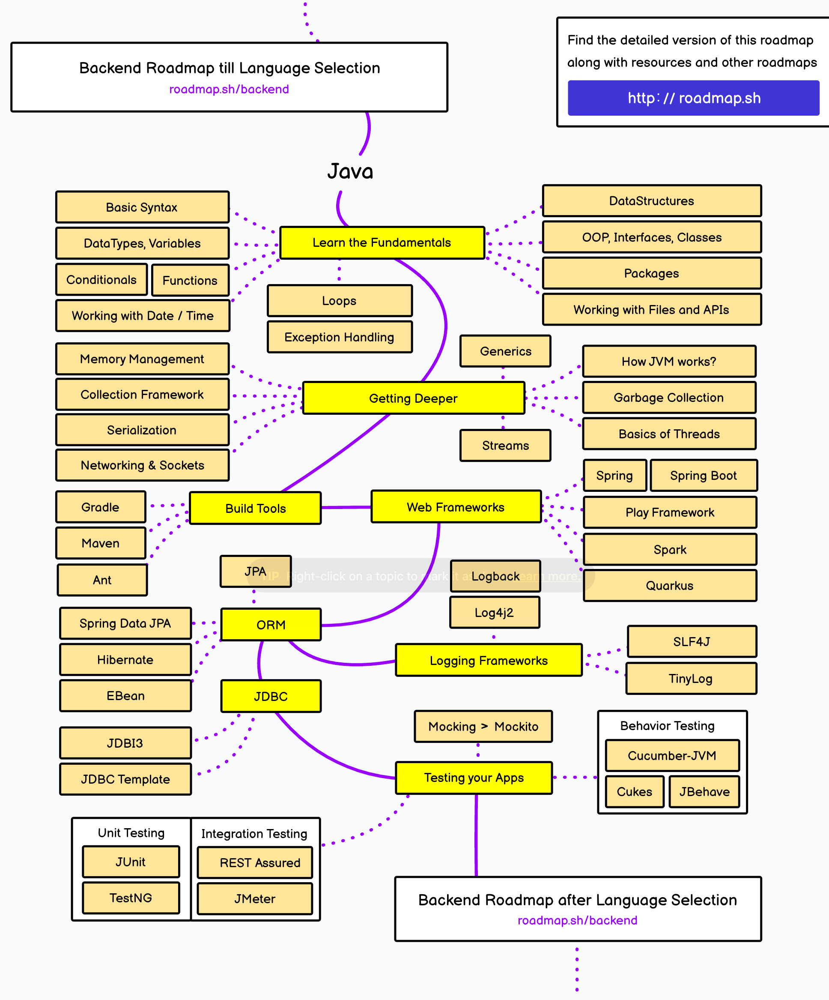

Welcome to the **Java Zero to Hero Guide**, a comprehensive resource designed for beginners to learn Java from scratch. Each folder in this repository contains examples and exercises that build upon the previous concepts.

By following this structured learning path, you'll gain a deep understanding of Java, from basics to advanced topics like multithreading, networking, and GUI development.

---

## How to Use This Repository
1. **Clone this Repository**: Use `git clone` or download the zip file.
2. **Follow the Learning Path**: Start with the first folder and gradually work your way through each folder.
3. **Run the Examples**: Each folder contains example code with explanations in the `README` file.
4. **Try the Exercises**: Attempt the exercises provided in each folder before checking the solutions.
5. **Build your Own Projects**: Once you feel confident, try creating your own projects.

---

## Table of Contents

### Beginner
1. [Java Basics](Concepts/01_Basics)
2. [Arrays & Strings](Concepts/02_Arrays_Strings)

### Intermediate
3. [Classes & Objects](Concepts/03_Classes_Objects)
4. [Inheritance & Polymorphism](Concepts/04_Inheritance)
5. [Exception Handling](Concepts/05_Exception_Handling)

### Advanced
6. [Multithreading](Concepts/06_Multithreading)
7. [Networking](Concepts/07_Networking)
8. [JDBC](Concepts/08_JDBC)
9. [AWT & Swing](Concepts/09_AWT_Swing)

---

### Requirements
- JDK installed: [Install JDK](https://www.oracle.com/java/technologies/javase-jdk11-downloads.html)
- IDE: You can use any Java IDE, but I recommend [VS Code](https://code.visualstudio.com/) or [IntelliJ IDEA](https://www.jetbrains.com/idea/).
- Basic knowledge of programming (optional but helpful).

---

### Cheatsheets
- [Princeton University Java Cheatsheet](https://introcs.cs.princeton.edu/java/11cheatsheet/)
- [Code with Harry Java Cheatsheet](https://www.codewithharry.com/blogpost/java-cheatsheet/)

---

### Roadmap
Below is the roadmap image to guide you through the learning path:

---

### Additional Resources
For a more detailed roadmap on learning Java, you can visit the [Java Roadmap](https://roadmap.sh/java).

---

### Repository Status
This repository is still in creation and is actively being updated and maintained. New content and improvements are added regularly. Stay tuned for more updates!

---

Start with the [Java Basics](Concepts/01_Basics) to begin your journey!